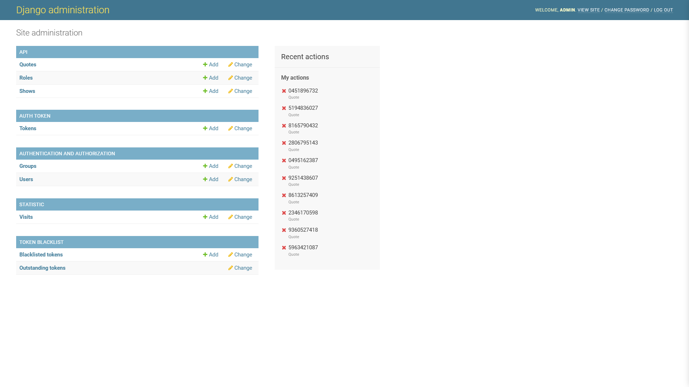

# Movie Quote API

This project is a Movie Quote API built using Django REST Framework. It provides quotes from various movies and TV series, allowing users to filter content based on family-friendly criteria.

## Features

- Retrieve random quotes from a wide range of movies and shows.
- Family-friendly mode to filter out quotes with adult language.
- Admin interface for managing quotes.
- Responsive frontend with a modern design.

## Screenshots


*Homepage of the Movie Quote API showing the main interface.*


*Displaying a random censored quote from the database.*


*Family-friendly mode activated to filter quotes.*


*Admin interface for managing quotes.*

## Getting Started

### Prerequisites

- Python 3.x
- Django
- Django REST Framework

### Installation

#### Linux

1. Clone the repository:
   ```bash
   git clone https://github.com/vishalbansal28/REST-API-using-django-rest-framework.git
   ```
2. Install Python 3:
   ```bash
   sudo apt install python3
   ```
3. Navigate to the project directory:
   ```bash
   cd movie-quote
   ```
4. Create a virtual environment:
   ```bash
   python3 -m venv venv
   ```
5. Activate the virtual environment:
   ```bash
   source venv/bin/activate
   ```
6. Configure the project:
   ```bash
   mv sample.config.py config.py
   ```
   Modify settings as needed.
7. Apply migrations:
   ```bash
   python3 manage.py migrate
   ```
8. Run the server:
   ```bash
   python3 manage.py runserver
   ```
9. Open your browser and visit `127.0.0.1:8000`.

#### Windows

1. Clone the repository or download it directly:
   ```bash
   git clone https://github.com/vishalbansal28/REST-API-using-django-rest-framework.git
   ```
2. Install Python 3 from [python.org](https://www.python.org/downloads/).
3. Navigate to the project directory:
   ```bash
   cd movie-quote
   ```
4. Create a virtual environment:
   ```bash
   python -m venv venv
   ```
5. Activate the virtual environment:
   ```bash
   venv\Scripts\activate
   ```
6. Configure the project:
   ```bash
   move sample.config.py config.py
   ```
   Modify settings as needed.
7. Apply migrations:
   ```bash
   python manage.py migrate
   ```
8. Run the server:
   ```bash
   python manage.py runserver
   ```
9. Open your browser and visit `127.0.0.1:8000`.

## Setup and Cleanup Scripts

To streamline the management of this project, two scripts have been added:

### Setup Script

The `setup.sh` script automates the process of setting up the project environment. It:
- Creates a virtual environment
- Installs dependencies
- Applies database migrations
- Starts the development server

Run the setup script using:
```bash
bash setup.sh
```

### Cleanup Script

The `cleanup.sh` script helps to clean up the project by removing unnecessary files and directories. It:
- Deletes Python cache directories
- Removes the SQLite database
- Clears log files
- Deletes the virtual environment

Run the cleanup script using:
```bash
bash cleanup.sh
```

## API Usage

- **`/v1/quote/`**: Retrieve a random quote from the database.
- **`/v1/quote?censored`**: Retrieve a random quote excluding those with adult language.
- **`/v1/shows/`**: Get a list of all available shows.
- **`/v1/shows/<show_slug>`**: Retrieve a random quote from a specific show.
- **`/admin/quotes/`**: Admin access to manage quotes.

## Contributing

Feel free to fork the repository and submit pull requests. For major changes, please open an issue first to discuss what you would like to change.

## License

This project is licensed under the MIT License. See the [LICENSE](LICENSE) file for details.

---

Developed by Vishal Bansal. Connect with me on [LinkedIn](https://www.linkedin.com/in/vishal-bansal-62a727192/) or check out my [GitHub](https://github.com/vishalbansal28/REST-API-using-django-rest-framework).
